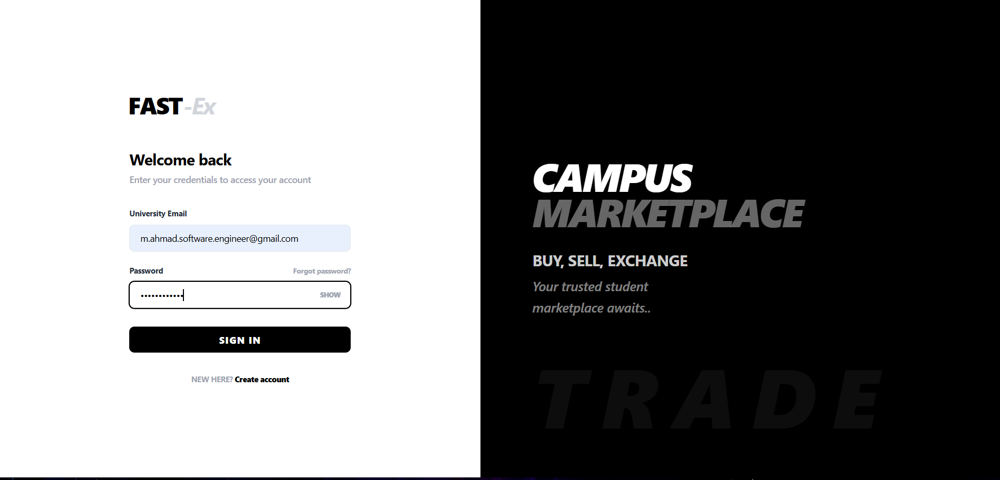
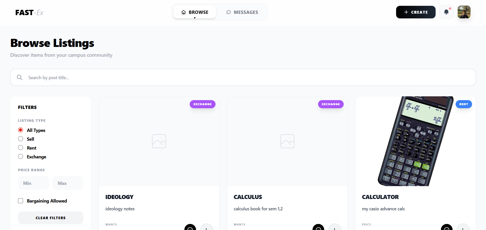
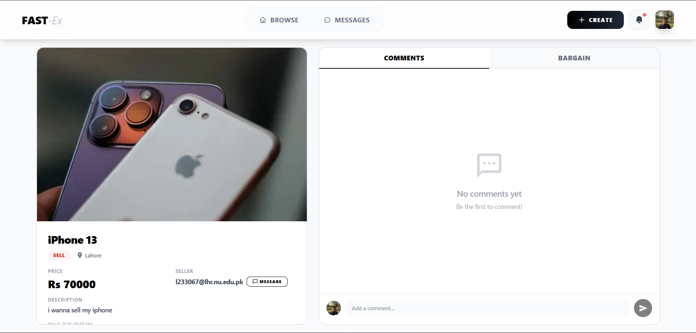
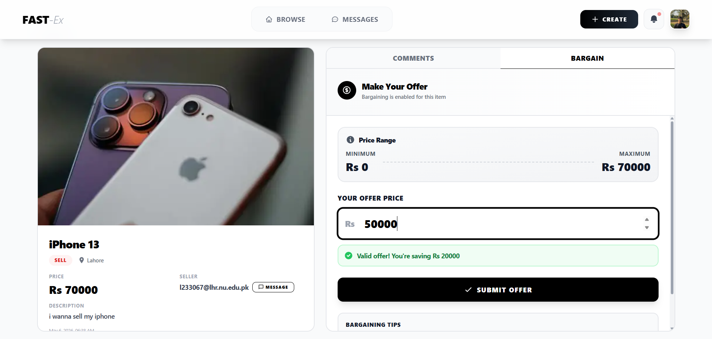
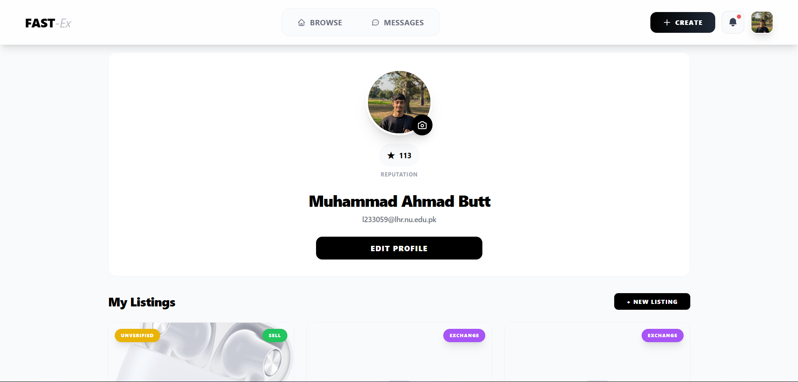
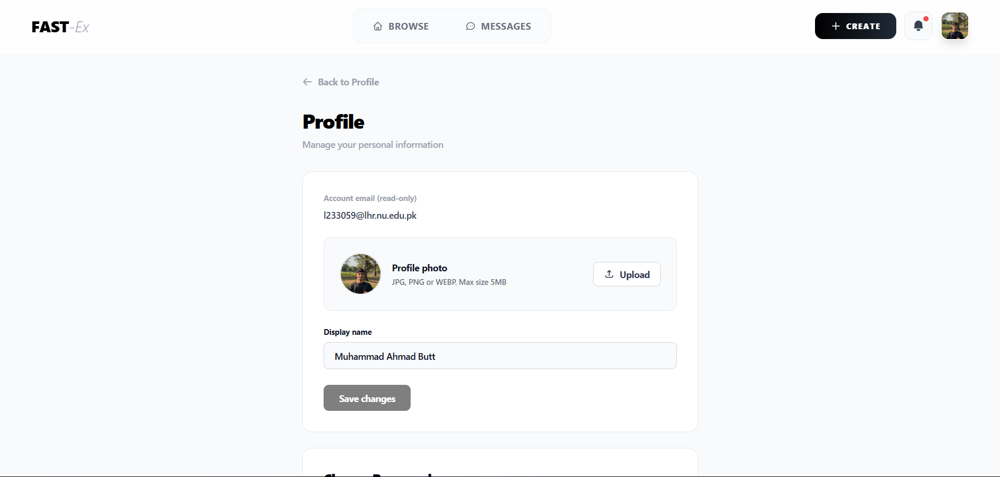
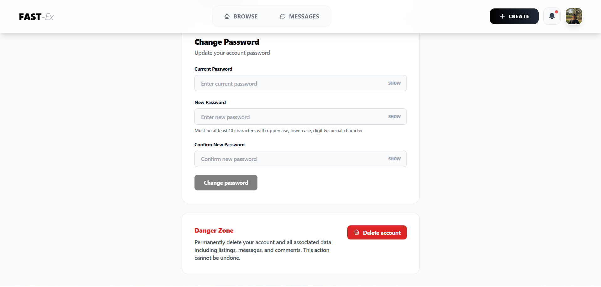
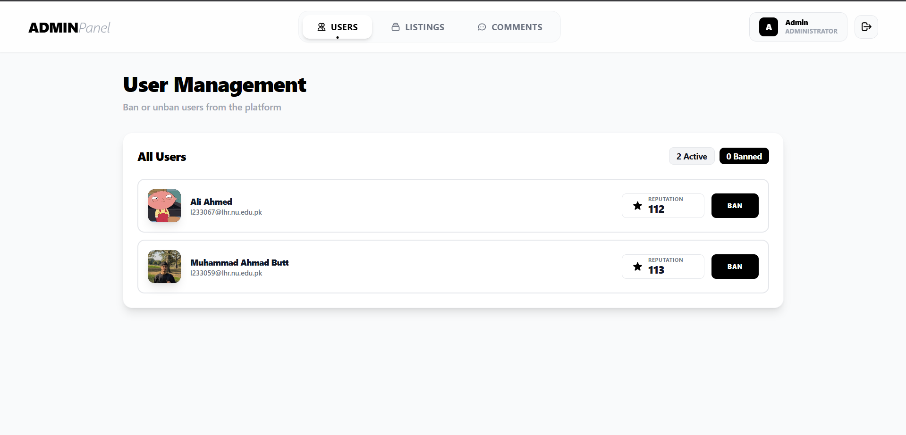
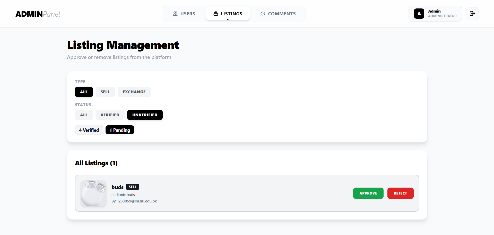
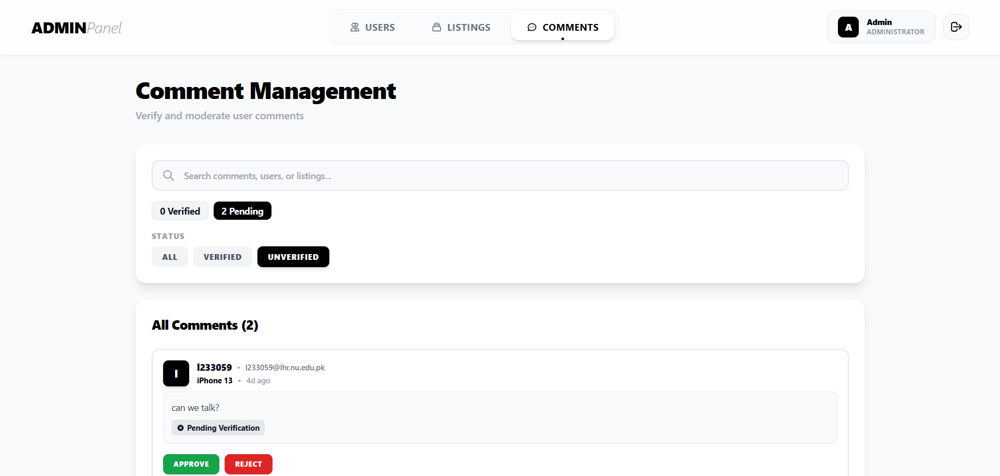

# FAST-Ex – Student-Centric Microservices Exchange Platform

## Overview
**FAST-Ex** is a robust, microservices-based exchange platform designed specifically for the university community. It facilitates a secure and efficient environment for students to **buy, sell, and exchange** items, integrated with a **reputation system** to ensure trust. The platform features real-time communication, automated notifications, and an event-driven architecture to handle high concurrency and scalability.

## University Details
**University:** FAST National University of Computer and Emerging Sciences  
**Campus:** Lahore  
**Program:** BS Software Engineering  

## Team Details
- **Ali Ahmed** – [syed-ali3](https://github.com/syed-ali3) – 23L-3067  
- **Muhammad Ahmad Butt** – [m-ahmad-butt](https://github.com/m-ahmad-butt) – 23L-3059

## Core Features
- **Microservices Architecture**: Distributed system with 7+ dedicated services (Auth, User, Listing, Messaging, etc.)
- **Real-time Messaging**: Instant chat capabilities powered by Socket.io and Redis.
- **Dynamic Reputation System**: Trust-based scoring for users to promote a safe trading community.
- **Event-Driven Infrastructure**: High-performance messaging using Apache Kafka and RabbitMQ.
- **Integrated Admin Dashboard**: Comprehensive control panel for platform management and user moderation.
- **Automated Notifications**: Real-time alerts for messages, listing updates, and platform activity.
- **Cloud-Ready Containerization**: Fully dockerized environment for seamless deployment and scaling.

## DEMO

## Tech Stack
### Frontend
- React.js
- Tailwind CSS

### Backend (Microservices)
- Node.js (Express.js)

### Infrastructure & Orchestration
- **Messaging**: Apache Kafka, RabbitMQ
- **Caching & Sessions**: Redis
- **Containerization**: Docker
- **Deployment**: AWS
- **API Gateway**: Custom Express-based Proxy

### Database & Authentication
- **Database**: MongoDB (Multi-instance)
- **Authentication**: Clerk (Frontend) & Custom JWT (Backend)

## License
This project is for educational purposes only.
